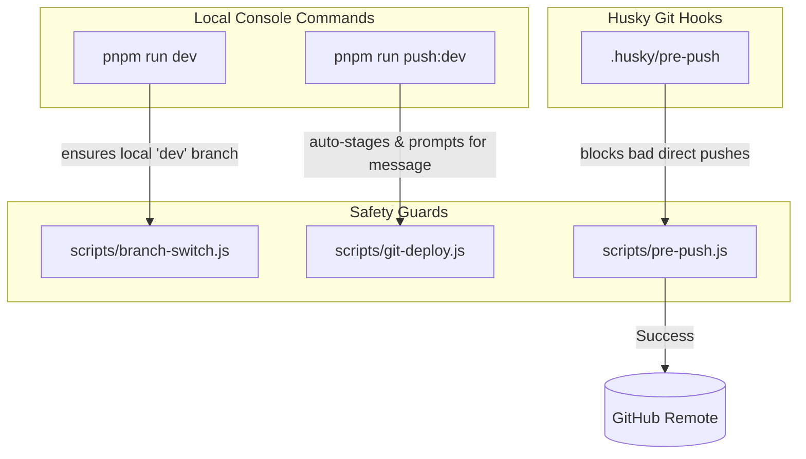

# 🛠️ Toastyyy — Git Workflow & Branch Safety System

Welcome to the automated git and branch safety workflow for the **Toastyyy** React ecosystem. This guide details the branch controls, interactive push commands, Husky pre-push hooks, and automated CI/CD pipelines configured for this project.

---

## 🌟 Workflow Architecture Overview

Our workspace is structured around two central git branches:
- **`dev`**: The active developers/staging branch. Automated unit tests, compilation, lint audits, and typechecks run on every push.
- **`prod`**: The production-ready live branch. Locked down for maximum protection. Pushes are gated and managed via manual PR merges from the `dev` branch.

To make collaboration easy and prevent accidental pushes to the production branch or dirty tree checkouts, we have created a cross-platform, Node-based safety wrapper.



---

## 💻 Available NPM Workflow Commands

Maintain a safe workspace using these two primary `pnpm` (or `npm`/`yarn`) scripts:

| Command | Action | Safety Policies Enforced |
| :--- | :--- | :--- |
| **`pnpm run dev`** | Safely checks out the `dev` branch and boots up the local Vite development server. | **Blocks checkout** and halts if there are uncommitted changes on a different branch to prevent merge conflicts. |
| **`pnpm run push:dev`** | Stages all changes, **prompts you in the terminal for a custom commit message**, commits the staged work, and pushes to remote `dev`. | **Enforces** that your local branch is `dev` and that the commit message is not empty. |

---

## 🛡️ Pre-Push Hook Safety Gates (Husky)

We've wired up a robust pre-push hook using **Husky** that intercepts all `git push` commands. Even if you run a manual command like `git push origin dev:prod` or `git push origin prod` from the wrong branch, the hook will step in and secure your repository:

### 1. The Branch Mismatch Gate
If you try to push code to the remote `prod` branch while checked out on `dev` (or any other branch), the push is rejected instantly:
```text
🛑 GIT PUSH REJECTED: Branch Mismatch Gate
--------------------------------------------------------
   You are attempting to push to remote 'prod' branch
   while checked out on local branch 'dev'.
   Please switch to the 'prod' branch first, or use:
     npm run push:dev
```

### 2. The Uncommitted Changes Gate
If you attempt to push to the production branch while holding unstaged or dirty changes in your working directory, the gate blocks the push:
```text
🛑 GIT PUSH REJECTED: Uncommitted Changes Gate
--------------------------------------------------------
   You have uncommitted local changes.
   Pushing to production with a dirty tree is blocked.
   Please commit or stash your changes before pushing:
     git status
```

---

## 🚀 GitHub Actions CI/CD Telemetry

Every push to your remote branches triggers automated quality verifications and deployments:

### 1. Push to `dev` (`dev-pipeline.yml`)
- Runs code formatting checks (`prettier`).
- Runs ESLint validation.
- Verifies TypeScript compiles (`tsc --noEmit`).
- Executes the Vitest unit/integration test suite.
- Performs a security auditing scan (`pnpm audit`).
- Audits compile sizes and builds a production dry-run.
- Sends detailed rich embeds showing status directly to your **Discord** channel!

### 2. PR from `dev` to `prod` (`pr-validation.yml`)
- Automatically gates code reviews using CodeRabbit AI integration.
- Sends Discord alerts on PR opening, reviewer comments, and approval states.

### 3. Push/Merge to `prod` (`prod-deployment.yml`)
- Triggers high-fidelity Vercel production deployment.
- Dispatches custom rich Discord cards showing live deployment URLs, authors, and duration.

---

## 🔒 Recommended GitHub Branch Protections

To make this workflow bulletproof for team collaboration, we recommend configuring these branch protection rules in your GitHub Repository Settings (`Settings` ➡️ `Branches` ➡️ `Add Rule`):

### 1. `prod` Branch Rules
- **Require a pull request before merging:** Enabled.
  - **Require approvals:** Enabled (Require at least 1 approval).
- **Require status checks to pass before merging:** Enabled.
  - Require `validate-and-test (Code Quality & Tests)` to pass.
- **Block direct pushes / Do not allow force pushes:** Enabled (prevents manual force-pushes from bypassing Husky hooks).

### 2. `dev` Branch Rules
- **Require status checks to pass before merging:** Enabled.
- **Do not allow force pushes:** Enabled.

---

## 👥 Safe Workflow Guide for Teams

Follow these best practices to maintain a clean git history and prevent conflicts:

### 1. Creating a Feature
Never work directly on `prod`. All development should start on `dev` or a feature branch:
```bash
# Switch to dev first (this ensures your local dev is clean)
pnpm run dev

# Create feature branch
git checkout -b feature/gourmet-toast
```

### 2. Stashing Changes
If you need to switch branches quickly but have unfinished work, stash them safely:
```bash
# Stash active changes
git stash -u

# Switch branch cleanly
git checkout prod

# Return and restore stashed work
pnpm run dev
git stash pop
```

### 3. Resolving Conflicts
Before merging a branch into `dev`, always rebase or merge `dev` into your feature branch to verify builds pass locally:
```bash
git checkout feature/gourmet-toast
git merge origin/dev

# Run validations locally to guarantee 100% success
pnpm run lint
pnpm run test
pnpm run build
```
