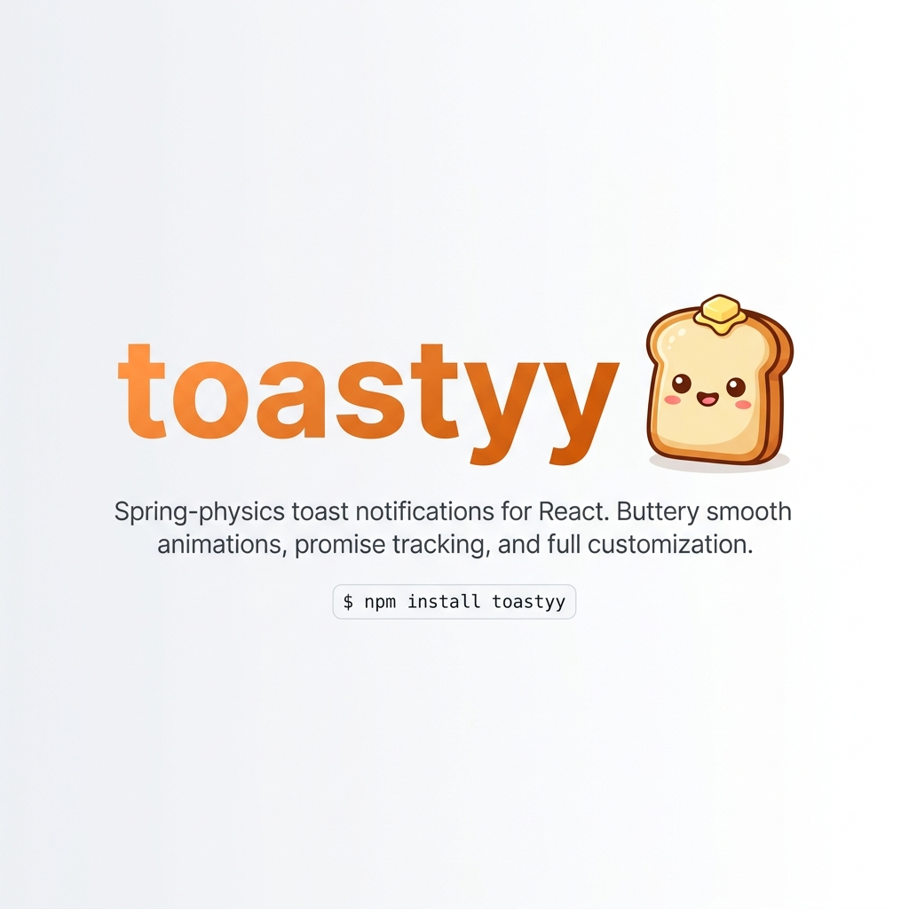

# 🍞 Toastyyy — The Interactive React Notification Ecosystem

<p align="center">
  
</p>

Toastyyy is a performance-first, highly customizable React notification system built on buttery-smooth spring physics. Designed for creative laboratory aesthetics, it features an interactive vector Mascot that dynamically blinks, reacts to hover scales, and tracks cursor gaze coordinates in real-time.

---

## 🌟 Key Features

*   **Interactive Toast Mascot:** A handcrafted, reactive vector toast character that tracks cursor gazes, blinks asynchronously, and wiggles/squashes on interactions.
*   **Dynamic Viewport Position Slots:** Render notifications cleanly across five designated layout channels (`top-left`, `top-right`, `bottom-left`, `bottom-center`, `bottom-right`).
*   **Real-Time Spring Bounce Coefficients:** Adjust animation stiffness and custom spring curves using elastic bounce controllers.
*   **Dual Theme Presets:** Refined light and dark modes matching sleek modern aesthetics.
*   **Behavioral Controls:** Timed progress indicators, Escape key closures, dynamic timestamps, and customizable action triggers.
*   **Gourmet Types:** Predefined styles for `default`, `success`, `error`, `warning`, `info`, `loading` spinners, and pulsing `promise` states.

---

## 🚀 Installation

Add the library to your React project:

```bash
npm install toastyy
```

Make sure you have `framer-motion` (v11.x or later) and `lucide-react` installed as peer dependencies.

---

## 💻 Quick Start

### 1. Wrap Your Root Component
Initialize the global toast queue by wrapping your tree context with the `ToastProvider`:

```tsx
import { ToastProvider } from 'toastyy'

export default function App() {
  return (
    <ToastProvider>
      <MainDashboard />
    </ToastProvider>
  )
}
```

### 2. Trigger Customized Alerts
Use the `useToasts` hook to fire or programmatically update toasts:

```tsx
import { useToasts } from 'toastyy'

export default function MainDashboard() {
  const { addToast } = useToasts()

  const fireSuccess = () => {
    addToast({
      type: 'success',
      title: 'Golden Toast Fired',
      description: 'Baked to absolute crispy perfection.',
      showDescription: true,
      position: 'bottom-right',
      bounce: 0.40,
      theme: 'light'
    })
  }

  return (
    <button onClick={fireSuccess}>
      Bake Sourdough
    </button>
  )
}
```

---

## ⚙️ Configuration Options

Each notification accepts the following parameters:

```typescript
interface ToastItem {
  type: 'default' | 'success' | 'error' | 'warning' | 'info' | 'loading' | 'promise'
  title: string
  description?: string
  showDescription?: boolean
  showAction?: boolean
  actionText?: string
  customColor?: string
  hasBorder?: boolean
  bounce?: number
  theme?: 'light' | 'dark'
  showProgress?: boolean
  closeOnEscape?: boolean
  showTimestamp?: boolean
  showCloseButton?: boolean
  position?: 'top-left' | 'top-right' | 'bottom-left' | 'bottom-center' | 'bottom-right'
  duration?: number
}
```

---

## 🔄 Programmatic Toast Updates (Promises)
You can dynamically transition a loader toast into a resolved success or error state by leveraging returned IDs and `updateToast`:

```tsx
import { useToasts } from 'toastyy'

const triggerProcess = () => {
  const id = addToast({
    type: 'loading',
    title: 'Uploading packages...',
    duration: 8000
  })

  setTimeout(() => {
    updateToast(id, {
      type: 'success',
      title: 'Upload Successful!',
      bounce: 0.15
    })
  }, 2000)
}
```

---

## 🛠️ Git Workflow Automation & Branch Safety

To ensure maximum safety and ease of use, Toastyyy features a built-in cross-platform Git workflow automation system. This handles automatic branch-switching and enforces safety policies during builds and deployments.

### Available Command Scripts:

- **`pnpm run dev`** (or `npm run dev`)
  - Automatically switches your local workspace to the `dev` branch.
  - Starts the local Vite development server.
  - *Safety:* Blocks checkout and alerts you if you have uncommitted changes on a different branch to prevent merge conflicts.

- **`pnpm run push:dev`** (or `npm run push:dev`)
  - Ensures you are on the `dev` branch.
  - Stages all your local changes automatically.
  - **Prompts you in the terminal to input a custom commit message** before committing.
  - Pushes your commits safely up to the remote `origin dev` branch.
  - *Safety:* Production branch `prod` is locked down for maximum safety; all production pushes must be handled via manual pull requests.

For complete workflow rules, safety hook internals, team guidelines, and recommended GitHub branch protection policies, check out our **[🛠️ Git Workflow & Safety Guide](file:///home/woopsy/project/Random/Toasty/GIT_WORKFLOW.md)**.

